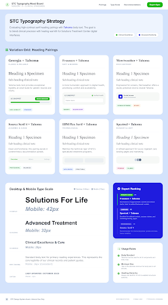

# STC Website v1

Project workspace for STC brand, prompt, and Stitch artifacts.

## Stitch Projects

- Project index page: [index.html](./index.html)
- Stitch project folders: [stitch-projects/](./stitch-projects/)

## Current Projects

- [stc-typography-mood-board-v1](./stitch-projects/stc-typography-mood-board-v1/)
- Live preview (Gist): [View as web page](https://htmlpreview.github.io/?https://gist.githubusercontent.com/Elevate-Studios-SF/0252a91cf15cc5e81144d48cfc6bbd44/raw/f6d76e34278c444fb6a9de438d271878035fd163/stc-typography-mood-board-v1.html)
- Source Gist: [gist.github.com/Elevate-Studios-SF/0252a91cf15cc5e81144d48cfc6bbd44](https://gist.github.com/Elevate-Studios-SF/0252a91cf15cc5e81144d48cfc6bbd44)

## Project Preview

## View As A Web Page

1. Open `index.html` locally in your browser, or run a local server from repo root:
   - `python3 -m http.server 8080`
   - then open `http://localhost:8080`
2. Optional: enable GitHub Pages for this repository (Branch: `main`, Folder: `/ (root)`) to publish `index.html` online.
